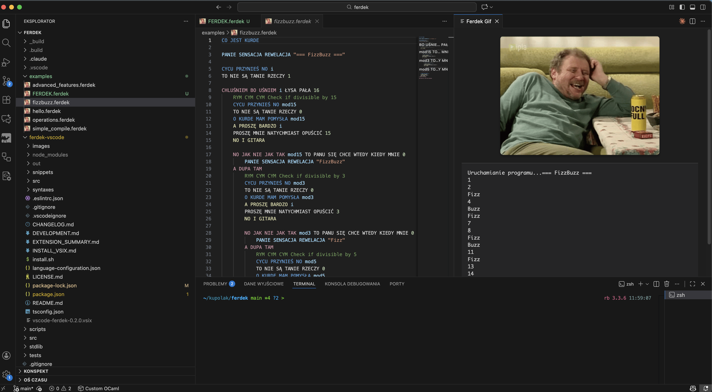

# Ferdek Language Support for VS Code

Language support for the **Ferdek** programming language - a Polish meme language with humorous and absurd syntax inspired by the classic Polish comedy.



## Features

- **Syntax Highlighting** - Color-coded syntax highlighting for all Ferdek language constructs
- **Code Snippets** - Quick snippets for common patterns (variables, functions, loops, file operations, etc.)
- **Language Configuration** - Comment and bracket pair matching
- **Run & Compile** - Commands to run and compile Ferdek programs
- **Hover Information** - Get quick information about language keywords
- **Code Completion** - Auto-complete for language keywords and functions

## Installation

1. Open VS Code
2. Go to Extensions (Ctrl+Shift+X / Cmd+Shift+X)
3. Search for "Ferdek Language Support"
4. Click Install

Or manually install the extension by cloning this repository into your VS Code extensions folder.

## Quick Start

### Create a new Ferdek file

1. Create a file with `.ferdek` extension
2. Start typing - use snippet `ferdek` to generate a basic program template

### Running Programs

- **Ctrl+Shift+F5** - Run the current Ferdek file
- **Ctrl+Shift+C** - Compile the current Ferdek file to C

## Example Program

```ferdek
CO JEST KURDE

RYM CYM CYM Calculate factorial
ALE WIE PAN JA ZASADNICZO silnia
NA TAKIE TEMATY NIE ROZMAWIAM NA SUCHO n
  NO JAK NIE JAK TAK BABKA DAWAJ RENTĘ n BABKA DAWAJ RENTĘ 1
    I JA INFORMUJĘ ŻE WYCHODZĘ 1
  DO CHAŁUPY ALE JUŻ
  
  CYCU PRZYNIEŚ NO wynik
  TO NIE SĄ TANIE RZECZY ROZDUPCĘ BANK n W MORDĘ JEŻA silnia(PASZOŁ WON n BABKA DAWAJ RENTĘ 1)
  I JA INFORMUJĘ ŻE WYCHODZĘ wynik
DO WIDZENIA PANU

CYCU PRZYNIEŚ NO x
TO NIE SĄ TANIE RZECZY 5
AFERA JEST result W MORDĘ JEŻA silnia(x)
PANIE SENSACJA REWELACJA result

MOJA NOGA JUŻ TUTAJ NIE POSTANIE
```

## Requirements

- VS Code 1.84.0 or higher
- Ferdek compiler/interpreter installed on your system

## Links

- [Ferdek Repository](https://github.com/kupolak/ferdek)
- [Report Issues](https://github.com/kupolak/ferdek/issues)

## License

MIT License - Copyright (c) Jakub Polak
